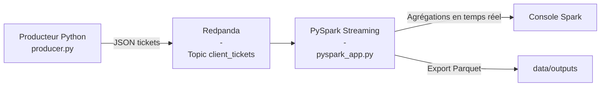

# Gestion de tickets clients en temps réel  
Redpanda · PySpark · Docker Compose

## 1. Contexte du projet

Ce projet est un Proof of Concept (POC) réalisé pour InduTechData.  
L’objectif est de démontrer la mise en place d’un pipeline temps réel composé de :

- Redpanda (compatible Kafka) pour l’ingestion de messages,
- un producteur Python générant des tickets clients,
- PySpark Structured Streaming pour le traitement en continu,
- une exportation des données enrichies au format Parquet.

## 2. Architecture du pipeline




## 3. Structure du projet

```
.
├── docker-compose.yml
├── README.md
├── ticket_producer/
│   ├── Dockerfile
│   └── producer.py
├── spark_app/
│   ├── Dockerfile
│   └── pyspark_app.py
├── data/
│   └── outputs/
└── inspect_output.py
```

## 4. Fonctionnement du système

### 4.1. Producteur Python (ticket_producer)

Le producteur envoie des tickets JSON au topic `client_tickets`.  
Les tickets contiennent :

- ticket_id  
- client_id  
- created_at  
- request  
- request_type  
- priority  

Le nombre de tickets envoyés est configurable via :

```
MAX_MESSAGES: "200"
```

### 4.2. Redpanda

Le broker Redpanda reçoit les tickets en temps réel dans le topic `client_tickets`.

Interface web Redpanda Console :  
http://localhost:8080

### 4.3. PySpark Structured Streaming

Le script `pyspark_app.py` :

1. lit en continu le topic Kafka ;
2. parse le JSON -> DataFrame structuré ;
3. enrichit avec `created_at_ts` + `support_team` ;
4. affiche des agrégations en continu ;
5. exporte les tickets enrichis au format Parquet.

Les résultats sont visibles dans les logs :

```
docker-compose logs -f spark_app
```

### 4.4. Export Parquet

Les tickets enrichis sont exportés ici :

```
data/outputs/
```

Pour les lire, utiliser :

```
python inspect_output.py
```

## 5. Lancement du projet

### Démarrer tous les services

```
docker-compose up --build
```

Services lancés :

- redpanda-0 (broker)
- console (interface web)
- ticket_producer (génération de tickets)
- spark_app (traitement temps réel)

### Stopper l’ensemble

```
docker-compose down
```

## 6. Visualisation des données

### 6.1. Messages dans Redpanda

1. Ouvrir http://localhost:8080  
2. Aller dans **Topics**  
3. Sélectionner **client_tickets**  
4. Onglet **Messages**

### 6.2. Statistiques temps réel

Dans les logs Spark :

```
+-----------------+--------+----------+
|request_type     |priority|nb_tickets|
+-----------------+--------+----------+
|incident         |HIGH    |16        |
|bug              |LOW     |17        |
...
```

### 6.3. Lecture offline des Parquet

Exemple via `inspect_output.py` :

```
Nombre total de lignes : 238
Répartition par type :
incident             75
question             58
bug                  54
demande_evolution    51
```

## 7. Vidéo de démonstration


Une démonstration vidéo du pipeline ETL en action est disponible **[sur YouTube ICI en lien cliquable](https://youtu.be/I837g0Q0vvA)** 


## 8. Contenu du ZIP final

```
docker-compose.yml
README.md
ticket_producer/
spark_app/
inspect_output.py
data/outputs/   (optionnel)
```

## 9. Conclusion

Ce POC valide la faisabilité d’un pipeline temps réel basé sur Redpanda et PySpark, incluant ingestion, enrichissement, streaming et export.  
Ce système constitue une base solide pour un futur système complet de gestion de tickets et d’analyse opérationnelle.


